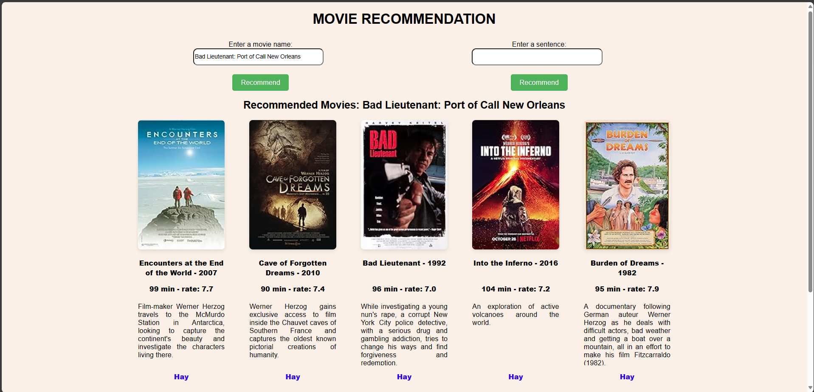

Code này phục vụ cho bài tập lớn môn học Đồ Án Chuyên Ngành Trí Tuệ Nhân Tạo

1. Thực hiện cào data về các phim bằng BeautifulSoup tại website: https://www.imdb.com
2. Tiền xử lý dữ liệu, ghép các data cần thiết lại
3. Xây dựng hệ thống recommend bằng cách tính độ tương đồng dữ liệu phim đầu vào với các phim có trong data.
4. Xây dựng giao diện bằng html, css, js để chọn phim đầu vào và đề xuất các phim có độ tương đồng cao.  
